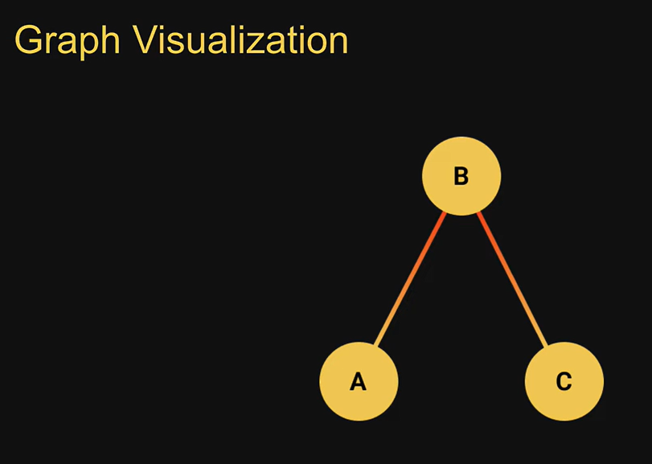
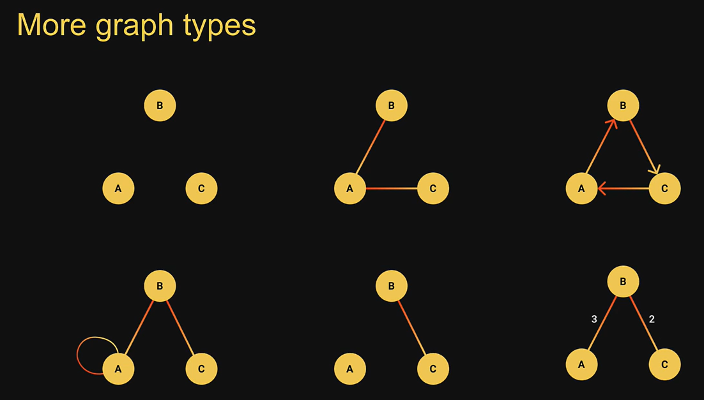
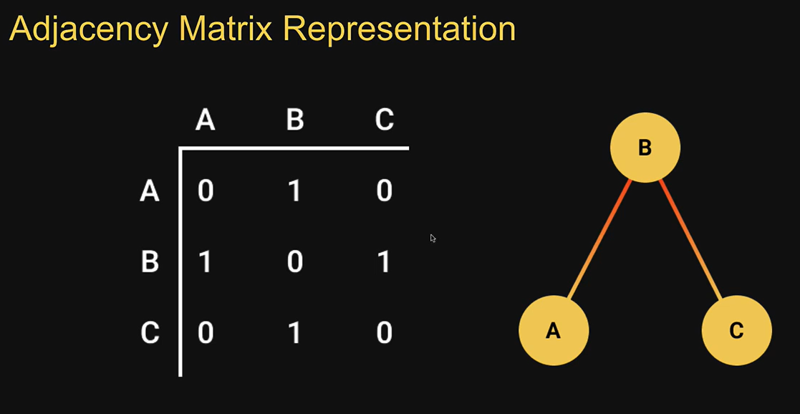
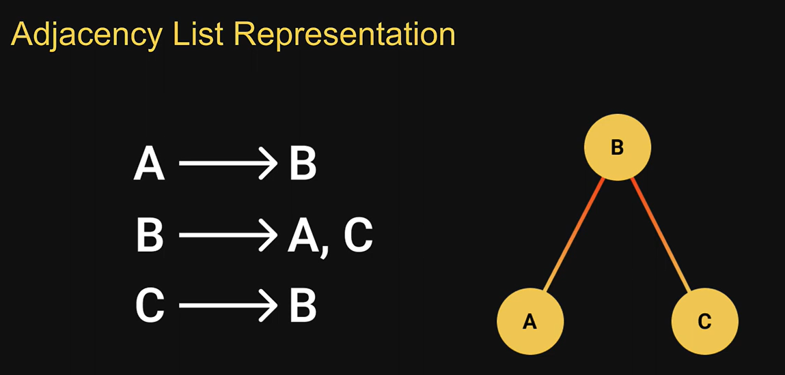

<div align="center">

# 🚀 JavaScript Data Structures & Algorithms

### Master Data Structures and Algorithms through JavaScript implementations, visual explanations, and interview-focused practice.

<p>
  
  
  
  
</p>

*A complete learning repository for mastering Data Structures and Algorithms in JavaScript with implementations, visualizations, and coding interview preparation.*

</div>

---

# 📖 Overview

This repository documents my journey of learning **Data Structures and Algorithms (DSA)** using **JavaScript**.

The goal is to build a strong understanding of DSA by implementing every data structure and algorithm from scratch while learning the intuition behind each concept.

To make complex topics easier to understand, this repository also includes **visual explanations, diagrams, and screenshots** collected during my learning process. These visual references help simplify difficult concepts that are often hard to understand through code alone.

Whether you're preparing for **coding interviews**, solving **LeetCode problems**, or strengthening your **computer science fundamentals**, this repository is designed to be a practical learning resource.

---

# ✨ Features

- 📚 JavaScript implementations of Data Structures
- ⚡ JavaScript implementations of Algorithms
- 🖼️ Visual explanations for difficult concepts
- 📈 Structured learning roadmap
- ⏱️ Time & Space Complexity references
- 🎯 Interview-focused topics
- 💻 LeetCode preparation
- 📖 Well-organized notes
- 🔄 Continuously updated while learning

---

# 🎯 Goals

- Learn Data Structures from fundamentals
- Understand Algorithms step by step
- Master common interview patterns
- Solve LeetCode problems efficiently
- Build a personal DSA reference
- Help other developers learn visually

---

# 👨‍💻 Who Is This Repository For?

This repository is useful for:

- Students learning DSA
- JavaScript developers
- Beginners preparing for LeetCode
- Software Engineering interview preparation
- Anyone who learns better through diagrams and visualizations

---

# 📚 Table of Contents

- Overview
- Repository Structure
- Learning Roadmap
- Data Structures
- Algorithms
- Visual Learning
- Resources
- Progress Tracker
- Contributing
- License

---

# 📂 Repository Structure

```text
JavaScript-DSA/
│
├── Arrays/
├── Strings/
├── Searching/
├── Sorting/
├── LinkedList/
├── Stack/
├── Queue/
├── HashTable/
├── Trees/
├── Graphs/
├── Heap/
├── Trie/
├── DynamicProgramming/
├── LeetCode/
├── Assets/
└── README.md
```

---

# 🛣️ Learning Roadmap

| Phase | Topic | Status |
|--------|-------|:------:|
| 1 | Big O Analysis | ✅ |
| 2 | Searching | ✅ |
| 3 | Sorting | ✅ |
| 4 | Recursion | ✅ |
| 5 | Two Pointers | ⏳ |
| 6 | Sliding Window | ⏳ |
| 7 | Linked List | ⏳ |
| 8 | Stack | ⏳ |
| 9 | Queue | ⏳ |
| 10 | Trees | ⏳ |
| 11 | Graphs | ⏳ |
| 12 | Dynamic Programming | ⏳ |

---

# 📦 Data Structures

## 🟢 Must Know

- Array
- String
- HashMap
- HashSet
- Linked List
- Stack
- Queue
- Deque
- Binary Tree
- Binary Search Tree
- Heap (Priority Queue)
- Graph
- Trie

---

## 🟡 Intermediate

- Segment Tree
- Fenwick Tree
- Union Find (DSU)
- Monotonic Stack
- Monotonic Queue

---

## 🔴 Advanced

- AVL Tree
- Red-Black Tree
- B Tree
- B+ Tree
- Skip List
- Bloom Filter
- Suffix Tree
- Suffix Array
- KD Tree
- Interval Tree
- Sparse Table

---

# ⚡ Algorithms

## 🟢 Essential

- Big O Analysis
- Searching
- Sorting
- Hashing
- Two Pointers
- Sliding Window
- Prefix Sum
- Binary Search
- Recursion
- Backtracking
- DFS
- BFS
- Tree Traversals
- Heap
- Greedy
- Dynamic Programming
- Graph Traversal

---

## 🟡 Intermediate

- Topological Sort
- Dijkstra
- KMP
- Rabin-Karp
- Trie
- Segment Tree
- Fenwick Tree
- Bit Manipulation
- Sweep Line

---

## 🔴 Advanced

- Bellman-Ford
- Floyd-Warshall
- Tarjan
- Kosaraju
- Manacher
- Suffix Array
- Network Flow
- Convex Hull
- Digit DP
- Bitmask DP

---

# 🖼️ Visual Learning

Understanding DSA is easier when concepts are visualized.

This repository includes diagrams and screenshots explaining difficult topics.

## Sorting Algorithms

- Insertion Sort
- Merge Sort
- Quick Sort

## Recursion

- Tower of Hanoi

## Linear Data Structures

- Stack
- Queue
- Circular Queue
- Linked List
- Doubly Linked List

## Hashing

- Hash Table
- Collision Handling

## Trees

- Binary Tree
- Binary Search Tree
- DFS
- BFS

## Graphs

- Graph Representation
- Graph Traversals

All visual references are available inside the **Assets/** folder.

---

# 📈 Progress Tracker

## Completed

- ✅ Big O Analysis
- ✅ Searching
- ✅ Sorting
- ✅ Recursion

## In Progress

- ⏳ Two Pointers
- ⏳ Sliding Window

## Upcoming

- Linked List
- Stack
- Queue
- Trees
- Graphs
- Dynamic Programming

---

# 📖 Learning Resources

This repository is inspired by some excellent educators.

| Resource | Purpose |
|----------|---------|
| Codevolution | JavaScript Implementations |
| Abdul Bari | Theory & Concepts |
| LeetCode | Problem Solving |
| NeetCode | Interview Preparation |

---

# 💡 Why This Repository?

Unlike many DSA repositories that only contain code, this project combines:

- JavaScript implementations
- Visual learning
- Theory
- Practical examples
- Interview preparation
- Personal learning notes

The aim is to make learning easier by explaining **how** algorithms work, not just **what** they do.

---

# 🤝 Contributing

Contributions, suggestions, and improvements are always welcome.

1. Fork the repository.
2. Create a new branch.

```bash
git checkout -b feature/your-feature
```

3. Commit your changes.

```bash
git commit -m "Add your feature"
```

4. Push your branch.

```bash
git push origin feature/your-feature
```

5. Open a Pull Request.

---

# 📄 License

This project is licensed under the **MIT License**.

---

# 👨‍💻 Author

**Parveen Kumar**

- 💼 LinkedIn: https://linkedin.com/in/parveen-kumar-664b8b24b
- 💻 GitHub: https://github.com/Parveen-collab

---

# ⭐ Support

If this repository helped you learn something new, consider giving it a **⭐ Star**.

It motivates me to continue improving the repository and adding more interview-focused content.

---

<div align="center">

### Happy Coding! 🚀

**"Consistency beats intensity. Keep practicing one problem at a time."**

</div>


### Javascript Implementaion by Codevolution
### Theory by Abdul Bari

### Insertion Sort Explained


### Quick Sort Explained


### Merge Sort Explained


### Tower Of Hanoi Explained


### Stack Visualization


### Queue Visualization-Enqueue


### Queue Visualization-Enqueue


### Circular Queue Visualization-Enqueue


### Circular Queue visualization-Dequeue


### Linked List


### Linked List with Tail


### Doubly Linked List


### Hash Table Visualization


### Hash Table Visualization-Handling Collisions


### Tree Data Structure Visualization


### Binary Tree Data Structure


### Binary Search Tree Data Structure


### DFS Traversal
### PreOrder Traversal


### InOrder Traversal


### BFS Traversal


### Graph Data Structure









### List of Data Structures
# Data Structures You Need for LeetCode (Priority)
### 🟢 Must Know (90% of interview problems)

* ✅ Array
* ✅ String
* ✅ HashMap
* ✅ HashSet
* ✅ Linked List
* ✅ Stack
* ✅ Queue
* ✅ Deque
* ✅ Binary Tree
* ✅ Binary Search Tree
* ✅ Heap (Priority Queue)
* ✅ Graph
* ✅ Trie
### 🟡 Intermediate
* Segment Tree
* Fenwick Tree (BIT)
* Union Find (DSU)
* Monotonic Stack
* Monotonic Queue
### 🔴 Advanced (Rare in interviews)
* AVL Tree
* Red-Black Tree
* B Tree
* B+ Tree
* Skip List
* Bloom Filter
* Suffix Tree
* Suffix Array
* KD Tree
* Interval Tree
* Sparse Table

## Recommended Learning Order
1. Arrays
2. Strings
3. HashMap & HashSet
4. Linked Lists
5. Stack
6. Queue & Deque
7. Binary Trees
8. Binary Search Trees
9. Heap (Priority Queue)
10. Trie
11. Graph
12. Union Find (DSU)
13. Segment Tree
14. Fenwick Tree
15. Advanced trees and specialized structures (only if targeting competitive programming or specialized roles)


### List of Algorithms
# Algorithms You Must Know for LeetCode
## 🟢 Essential (Learn First)

* Arrays & Strings techniques
* Hashing
* Two Pointers
* Sliding Window
* Prefix Sum
* Binary Search
* Recursion
* Backtracking
* BFS
* DFS
* Tree Traversals
* Heap (Priority Queue)
* Greedy
* Dynamic Programming
* Graph Traversal
* Union Find (DSU)
## 🟡 Intermediate
* Topological Sort
* Dijkstra
* Monotonic Stack
* Monotonic Queue
* KMP
* Rabin-Karp
* Trie
* Segment Tree
* Fenwick Tree
* Bit Manipulation
* Sweep Line
## 🔴 Advanced (Mostly for Hard Problems)
* Bellman-Ford
* Floyd-Warshall
* Tarjan
* Kosaraju
* Manacher
* Suffix Array
* Suffix Tree
* Aho-Corasick
* Network Flow
* Convex Hull
* Sparse Table
* Digit DP
* Bitmask DP

## Recommended Learning Order
1. Big O Analysis=done
2. Searching (Linear, Binary)=done
3. Sorting=done
4. Two Pointers
5. Sliding Window
6. Prefix Sum
7. Recursion=done
8. Backtracking
9. Trees (DFS, BFS, Traversals)
10. Binary Search Variations
11. Heap (Priority Queue)
12. Greedy
13. Graph Algorithms (BFS, DFS, Topological Sort, Dijkstra)
14. Dynamic Programming
15. Trie
16. Union Find (DSU)
17. Monotonic Stack & Queue
18. Segment Tree & Fenwick Tree
19. String Algorithms (KMP, Rabin-Karp)
20. Advanced Algorithms (only if needed)
