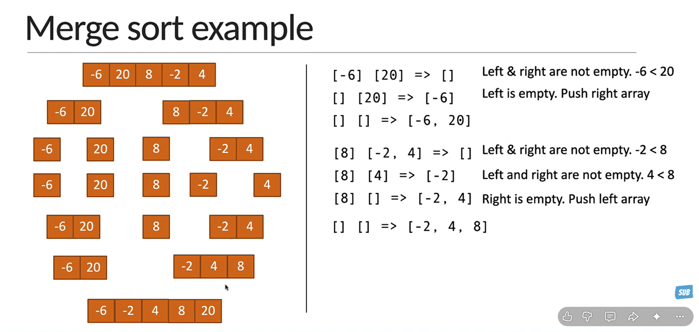

### Javascript Implementaion by Codevolution
### Theory by Abdul Bari

### Insertion Sort Explained

### Quick Sort Explained

### Merge Sort Explained

### List of Data Structures
## 1. Arrays

* Static Array
* Dynamic Array (ArrayList / Vector)
* Multidimensional Array (2D, 3D)

**Use Cases**

* Index-based access
* Sliding Window
* Prefix Sum
* Sorting

---

## 2. Strings

* Character Arrays
* Mutable Strings (StringBuilder)

**Use Cases**

* Pattern matching
* Parsing
* Text processing

---

## 3. Linked Lists

* Singly Linked List
* Doubly Linked List
* Circular Linked List

**Use Cases**

* Fast insertion/deletion
* LRU Cache
* Undo/Redo

---

## 4. Stack (LIFO)

**Operations**

* Push
* Pop
* Peek

**Use Cases**

* Balanced Parentheses
* DFS
* Expression Evaluation
* Backtracking

---

## 5. Queue (FIFO)

Types

* Simple Queue
* Circular Queue
* Priority Queue
* Deque (Double Ended Queue)

**Use Cases**

* BFS
* Scheduling
* Sliding Window Maximum

---

## 6. Hash Table (HashMap / HashSet)

Types

* HashMap
* HashSet
* LinkedHashMap
* TreeMap

**Use Cases**

* Fast lookup
* Counting frequency
* Duplicate detection

---

## 7. Trees

Basic Trees

* Binary Tree
* Binary Search Tree (BST)

Balanced Trees

* AVL Tree
* Red-Black Tree

Special Trees

* Heap
* Trie
* Segment Tree
* Fenwick Tree (Binary Indexed Tree)
* B Tree
* B+ Tree
* N-ary Tree

---

## 8. Heap

Types

* Min Heap
* Max Heap

**Use Cases**

* Top K Elements
* Priority Scheduling
* Median Finding

---

## 9. Trie (Prefix Tree)

**Use Cases**

* Autocomplete
* Dictionary
* Prefix Search
* Word Search

---

## 10. Graph

Representations

* Adjacency List
* Adjacency Matrix

Types

* Directed Graph
* Undirected Graph
* Weighted Graph
* Unweighted Graph
* DAG (Directed Acyclic Graph)

---

## 11. Set

Types

* HashSet
* TreeSet
* LinkedHashSet

---

## 12. Map (Dictionary)

Types

* HashMap
* TreeMap
* LinkedHashMap

---

## 13. Disjoint Set (Union Find)

Operations

* Find
* Union
* Path Compression
* Union by Rank

**Use Cases**

* Connected Components
* Kruskal's Algorithm

---

## 14. Skip List

**Use Cases**

* Ordered data
* Fast search
* Database indexing

---

## 15. Bloom Filter

**Use Cases**

* Fast membership testing
* Caching
* Databases

---

## 16. Sparse Table

**Use Cases**

* Range Minimum Query (RMQ)

---

## 17. Suffix Tree

**Use Cases**

* Pattern matching
* String algorithms

---

## 18. Suffix Array

**Use Cases**

* Text searching
* Longest Common Prefix

---

## 19. Interval Tree

**Use Cases**

* Interval overlap
* Calendar applications

---

## 20. KD Tree

**Use Cases**

* Nearest neighbor search
* Spatial indexing

---

# Data Structures You Need for LeetCode (Priority)

### 🟢 Must Know (90% of interview problems)

* ✅ Array
* ✅ String
* ✅ HashMap
* ✅ HashSet
* ✅ Linked List
* ✅ Stack
* ✅ Queue
* ✅ Deque
* ✅ Binary Tree
* ✅ Binary Search Tree
* ✅ Heap (Priority Queue)
* ✅ Graph
* ✅ Trie

---

### 🟡 Intermediate

* Segment Tree
* Fenwick Tree (BIT)
* Union Find (DSU)
* Monotonic Stack
* Monotonic Queue

---

### 🔴 Advanced (Rare in interviews)

* AVL Tree
* Red-Black Tree
* B Tree
* B+ Tree
* Skip List
* Bloom Filter
* Suffix Tree
* Suffix Array
* KD Tree
* Interval Tree
* Sparse Table

## Recommended Learning Order

1. Arrays
2. Strings
3. HashMap & HashSet
4. Linked Lists
5. Stack
6. Queue & Deque
7. Binary Trees
8. Binary Search Trees
9. Heap (Priority Queue)
10. Trie
11. Graph
12. Union Find (DSU)
13. Segment Tree
14. Fenwick Tree
15. Advanced trees and specialized structures (only if targeting competitive programming or specialized roles)

### List of Algorithms
If you're preparing for **LeetCode**, **coding interviews**, or **software engineering roles**, here are the algorithms you should learn, organized by category.

---

# 1. Searching Algorithms

* Linear Search
* Binary Search
* Ternary Search
* Jump Search
* Interpolation Search
* Exponential Search

---

# 2. Sorting Algorithms

### Basic

* Bubble Sort
* Selection Sort
* Insertion Sort

### Intermediate

* Merge Sort
* Quick Sort
* Heap Sort

### Advanced

* Counting Sort
* Radix Sort
* Bucket Sort
* Shell Sort

---

# 3. Two Pointer Algorithms

* Opposite Two Pointers
* Same Direction Two Pointers
* Fast & Slow Pointer (Floyd's Cycle Detection)

---

# 4. Sliding Window

* Fixed Size Window
* Variable Size Window

---

# 5. Prefix Sum

* Prefix Sum
* Difference Array
* Running Sum

---

# 6. Binary Search Algorithms

* Binary Search on Sorted Array
* Binary Search on Answer
* Lower Bound
* Upper Bound
* Rotated Array Search

---

# 7. Recursion

* Basic Recursion
* Divide and Conquer
* Tail Recursion

---

# 8. Backtracking

* Generate Permutations
* Generate Combinations
* Subsets
* N Queens
* Sudoku Solver
* Word Search

---

# 9. Divide and Conquer

* Merge Sort
* Quick Sort
* Closest Pair
* Maximum Subarray

---

# 10. Greedy Algorithms

* Activity Selection
* Fractional Knapsack
* Job Scheduling
* Huffman Coding
* Gas Station
* Jump Game

---

# 11. Dynamic Programming (DP)

### Basic

* Fibonacci
* Climbing Stairs
* House Robber

### Intermediate

* 0/1 Knapsack
* Coin Change
* Longest Increasing Subsequence
* Longest Common Subsequence

### Advanced

* DP on Trees
* DP on Graphs
* Bitmask DP
* Digit DP

---

# 12. Graph Algorithms

### Traversal

* Breadth First Search (BFS)
* Depth First Search (DFS)

### Shortest Path

* Dijkstra
* Bellman-Ford
* Floyd-Warshall

### Minimum Spanning Tree

* Kruskal
* Prim

### Topological

* Kahn's Algorithm
* DFS Topological Sort

### Connectivity

* Union Find (DSU)
* Tarjan's Algorithm
* Kosaraju's Algorithm

### Other

* Cycle Detection
* Bipartite Graph Check

---

# 13. Tree Algorithms

* Tree Traversals

  * Preorder
  * Inorder
  * Postorder
  * Level Order
* Lowest Common Ancestor (LCA)
* Diameter of Tree
* Balanced Tree Check
* BST Validation
* Serialize & Deserialize Tree

---

# 14. Heap Algorithms

* Heapify
* Top K Elements
* Kth Largest Element
* Merge K Sorted Lists
* Median Finder

---

# 15. Trie Algorithms

* Prefix Search
* Word Search
* Auto Complete

---

# 16. String Algorithms

* KMP Algorithm
* Rabin-Karp
* Z Algorithm
* Manacher's Algorithm
* Trie-based Matching

---

# 17. Bit Manipulation

* XOR Tricks
* Bit Masking
* Count Set Bits
* Power of Two
* Single Number
* Subset Generation

---

# 18. Mathematical Algorithms

* Euclidean Algorithm (GCD)
* LCM
* Fast Exponentiation
* Sieve of Eratosthenes
* Prime Factorization
* Modular Arithmetic

---

# 19. Interval Algorithms

* Merge Intervals
* Insert Interval
* Meeting Rooms
* Sweep Line Algorithm

---

# 20. Matrix Algorithms

* Matrix Traversal
* Spiral Matrix
* Rotate Matrix
* Flood Fill
* Island Problems

---

# 21. Union Find (DSU)

* Union by Rank
* Path Compression

---

# 22. Monotonic Data Structure Algorithms

* Monotonic Stack
* Monotonic Queue

---

# 23. Topological Algorithms

* Kahn's Algorithm
* DFS Topological Sort

---

# 24. Network Flow (Advanced)

* Ford-Fulkerson
* Edmonds-Karp
* Dinic Algorithm

---

# 25. Computational Geometry (Advanced)

* Convex Hull
* Graham Scan
* Line Sweep

---

# 26. Randomized Algorithms

* Reservoir Sampling
* Fisher-Yates Shuffle
* QuickSelect

---

# 27. Advanced String Algorithms

* Suffix Array
* Suffix Tree
* Aho-Corasick

---

# 28. Advanced Range Query Algorithms

* Segment Tree
* Fenwick Tree (Binary Indexed Tree)
* Sparse Table

---

# Algorithms You Must Know for LeetCode

## 🟢 Essential (Learn First)

* Arrays & Strings techniques
* Hashing
* Two Pointers
* Sliding Window
* Prefix Sum
* Binary Search
* Recursion
* Backtracking
* BFS
* DFS
* Tree Traversals
* Heap (Priority Queue)
* Greedy
* Dynamic Programming
* Graph Traversal
* Union Find (DSU)

---

## 🟡 Intermediate

* Topological Sort
* Dijkstra
* Monotonic Stack
* Monotonic Queue
* KMP
* Rabin-Karp
* Trie
* Segment Tree
* Fenwick Tree
* Bit Manipulation
* Sweep Line

---

## 🔴 Advanced (Mostly for Hard Problems)

* Bellman-Ford
* Floyd-Warshall
* Tarjan
* Kosaraju
* Manacher
* Suffix Array
* Suffix Tree
* Aho-Corasick
* Network Flow
* Convex Hull
* Sparse Table
* Digit DP
* Bitmask DP

## Recommended Learning Order

1. Big O Analysis
2. Searching (Linear, Binary)
3. Sorting
4. Two Pointers
5. Sliding Window
6. Prefix Sum
7. Recursion
8. Backtracking
9. Trees (DFS, BFS, Traversals)
10. Binary Search Variations
11. Heap (Priority Queue)
12. Greedy
13. Graph Algorithms (BFS, DFS, Topological Sort, Dijkstra)
14. Dynamic Programming
15. Trie
16. Union Find (DSU)
17. Monotonic Stack & Queue
18. Segment Tree & Fenwick Tree
19. String Algorithms (KMP, Rabin-Karp)
20. Advanced Algorithms (only if needed)
